# 🏗️ Arquitectura del Sistema AdminConstruct

## Diagrama de Arquitectura

## Patrón de Arquitectura

### 🎯 Arquitectura de 3 Capas

1. **Capa de Presentación**
   - Cliente SPA (React)
   - Panel Admin (Razor Pages)

2. **Capa de Lógica de Negocio**
   - API REST con JWT
   - Servicios de negocio
   - Validaciones

3. **Capa de Datos**
   - PostgreSQL
   - Entity Framework Core
   - Migraciones automáticas

### 🔐 Seguridad

```mermaid
sequenceDiagram
    participant C as Cliente
    participant A as API
    participant DB as Database
    
    C->>A: POST /api/auth/login
    A->>DB: Validar credenciales
    DB-->>A: Usuario válido
    A-->>C: JWT Token
    
    C->>A: GET /api/products (+ JWT)
    A->>A: Validar JWT
    A->>DB: Query productos
    DB-->>A: Datos
    A-->>C: Productos JSON
```

### 📦 Contenedorización

## Flujo de Datos

### Compra de Productos

### Alquiler de Maquinaria

## Tecnologías por Capa

### Frontend (Cliente SPA)
- **Framework**: React 18
- **Language**: TypeScript
- **Build Tool**: Vite
- **Styling**: TailwindCSS
- **Routing**: React Router
- **HTTP Client**: Axios
- **State**: localStorage (carrito)

### Backend (API REST)
- **Framework**: ASP.NET Core 8.0
- **ORM**: Entity Framework Core
- **Auth**: JWT Bearer
- **Validation**: Data Annotations
- **Documentation**: Swagger/OpenAPI
- **Email**: SMTP (configurable)

### Backend (Panel Admin)
- **Framework**: ASP.NET Core MVC
- **View Engine**: Razor Pages
- **Auth**: Cookie Authentication
- **Export**: iTextSharp (PDF), EPPlus (Excel)

### Database
- **RDBMS**: PostgreSQL 16
- **Migrations**: EF Core Migrations
- **Connection Pooling**: Npgsql

### Testing
- **Framework**: xUnit
- **Mocking**: Moq
- **Database**: InMemory Provider

### DevOps
- **Containerization**: Docker
- **Orchestration**: Docker Compose
- **CI/CD**: GitHub Actions
- **Registry**: GitHub Container Registry

## Escalabilidad

### Horizontal Scaling

### Caching Strategy (Futuro)

## Seguridad Implementada

- ✅ **Autenticación JWT** con tokens firmados
- ✅ **Roles** (Administrador, Cliente)
- ✅ **HTTPS** ready (configurar certificados)
- ✅ **CORS** configurado
- ✅ **SQL Injection** protección via EF Core
- ✅ **XSS** protección via React
- ✅ **Password Hashing** con Identity
- ✅ **Rate Limiting** (recomendado agregar)

## Monitoreo (Recomendado)

Para producción, considera agregar:

- **Application Insights** (Azure)
- **Sentry** (Error tracking)
- **Prometheus + Grafana** (Métricas)
- **ELK Stack** (Logs)

## Próximos Pasos de Arquitectura

1. **Microservicios**: Separar en servicios independientes
2. **Event-Driven**: Implementar mensajería (RabbitMQ/Kafka)
3. **CQRS**: Separar comandos de consultas
4. **API Gateway**: Agregar Kong o Ocelot
5. **Service Mesh**: Implementar Istio
