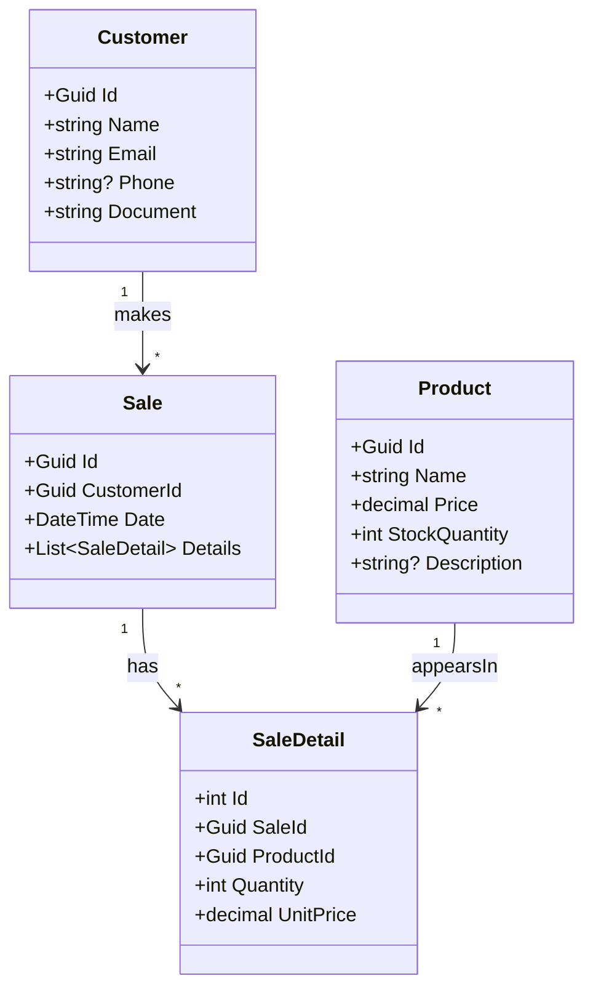

# Diagrama de clases (simplificado)

```mermaid
classDiagram
  class Product {
    +Guid Id
    +string Name
    +decimal Price
    +int StockQuantity
    +string? Description
  }
  class Customer {
    +Guid Id
    +string Name
    +string Email
    +string? Phone
    +string Document
  }
  class Sale {
    +Guid Id
    +Guid CustomerId
    +DateTime Date
    +List~SaleDetail~ Details
  }
  class SaleDetail {
    +int Id
    +Guid SaleId
    +Guid ProductId
    +int Quantity
    +decimal UnitPrice
  }

  Customer "1" --> "*" Sale : makes
  Sale "1" --> "*" SaleDetail : has
  Product "1" --> "*" SaleDetail : appearsIn
```
