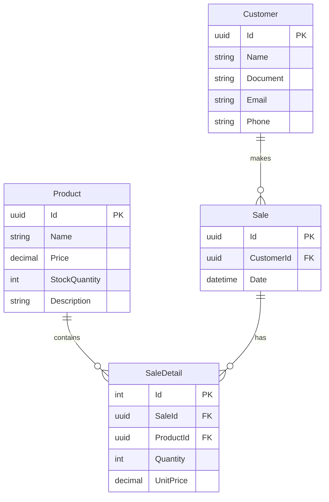

# Diagrama ER (simplificado)

```mermaid
erDiagram
  Product ||--o{ SaleDetail : contains
  Customer ||--o{ Sale : makes
  Sale ||--o{ SaleDetail : has

  Product {
    uuid Id PK
    string Name
    decimal Price
    int StockQuantity
    string Description
  }
  Customer {
    uuid Id PK
    string Name
    string Document
    string Email
    string Phone
  }
  Sale {
    uuid Id PK
    uuid CustomerId FK
    datetime Date
  }
  SaleDetail {
    int Id PK
    uuid SaleId FK
    uuid ProductId FK
    int Quantity
    decimal UnitPrice
  }
```
